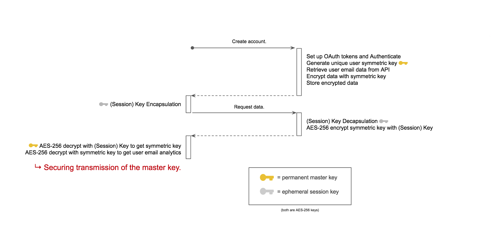

# Post-Quantum End-to-End Encryption Protocol

## Benchmarks

Using CRYSTALS KYBER and AES-256 GCM.

|                 Client                |                      |                        Server                       |
|---------------------------------------|:--------------------:|-----------------------------------------------------|
|1. Encapsulate session key             |                      |                                                     |
|                                       |          c >         |                                                     |
|                                       |                      |2. Decapsulate session key                           |
|                                       |                      |3. Encrypt master key with session key               |
|                                       |                      |(send encrypted master key with encrypted email data)|
|                                       |  < enc_mk, enc_data  |                                                     |
|4. Decrypt master key with session key |                      |                                                     |
|5. Decrypt email data with master key  |                      |                                                     |

Forward secrecy can't be achieved unless the master key is changed regularly and data is re-encrypted.

|                |     Step 1     |    Step 2     |     Step 3     |     Step 4      |     Step 5     |
|----------------|:--------------:|:-------------:|:--------------:|:---------------:|:--------------:|
|**KYBER-512**   |         211    |       121     |         4      |        9        |         195    |
|**KYBER-768**   |         301    |       169     |         4      |        9        |         195    |
|**KYBER-1024**  |         378    |       241     |         4      |        9        |         195    |
|**PRE-QUANTUM** |          44    |       2883    |         4      |        9        |         195    |

(values in microseconds)

New pre-quantum benchmarks show an outlier of RSA decryption taking comparatively longer than previous benchmarks. The Go standard library was used. Significant overhead comes from the DecryptOAEP function within RSA.decrypt(): (DecodeKey: 9, ParsePKCS1PrivateKey: 65, DecryptOAEP: 2809).

Because of this, the post-quantum scheme actually out-performs the pre-quantum scheme. The implementation reflects actual code programmers use in the real-world. Seeing these values gives insight into real performance time of implemented end-to-end schemes. Further research to be done in Go standard library's DecryptOAEP function.

## Benchmark Stages

**I. Key Establishment (32 bytes)**

    1. Encapsulate session key

    2. Decapsulate session key

    3. Encrypt master key with session key

    4. Decrypt master key with session key

**II. Decrypting Data (150,000 bytes)**

    5. Decrypt email data with master key

